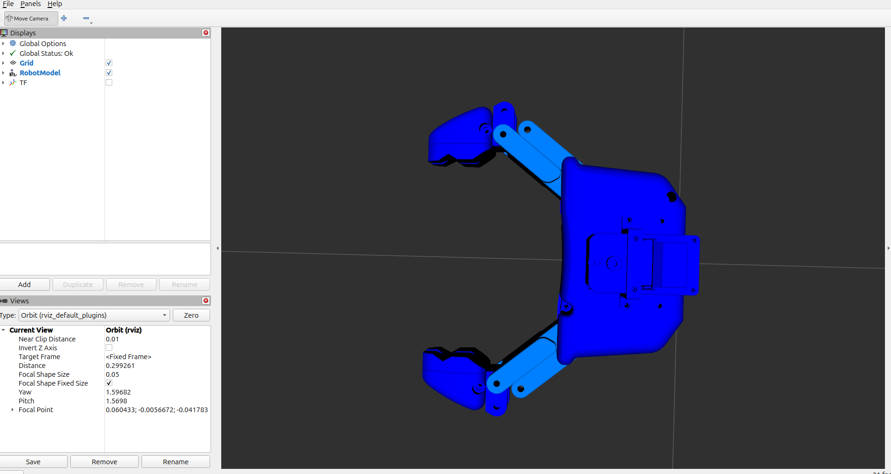

# Pinc Open Driver

**pinc_open_driver** provides a ROS 2 hardware interface that allows users to switch between
a mock interface and the actual hardware of Pollen Robotics' open-source
 [Pinc Open Gripper](https://pollen-robotics.github.io/PincOpen/ "Pinc Open Gripper") gripper.
 It includes a simplified URDF based on the Pinc Open Gripper design which allows users to
 incorporate this gripper into their existing robot URDF.
 It also provides a YAML file that sets up two controllers: **position_controllers** and **joint_trajectory_controller**.
The package enables development and testing with either simulated or physical hardware.
It integrates with **ros2_control** and supports easy switching between modes.

<p align="center">
  
  
</p>

## Getting Started

Launch one (and only one) of these three launches

### Display Launch
* The display launch loads the robot description and uses the joint_state_publisher_gui to send
commands to the visualized model.
```
clear; ros2 launch pinc_open_driver display_gripper.py
```

> Note: The URDF includes a simplified link model and does not model the exact kinematic 4-bar linkage.


### Mock Launch
* The mock launch activates the controllers and simulates the hardware.
The default controller activates is the joint_trajectory_controller commands can be sent via command line, using joint_trajectory_controller_gui via rqt, or our simple gui described below.

```
clear; ros2 launch pinc_open_driver display_gripper.py
```

This activates the "mock" loop back interface with a RViz viewer.

### Hardware Launch

To use the hardware gripper, first set up the serial communications:

#### Serial Setup

On initial set up on a specific computer, navigate to the `pinc_open_driver` directory,
Then, copy the provided `udev` rules below to enable serial communication:

```bash
sudo cp 99-pinc-gripper.rules /etc/udev/rules.d
sudo udevadm control --reload-rules
sudo udevadm trigger
```

#### Hardware Launch

```
clear; ros2 launch pinc_open_driver hardware_launch.py
```

This activates the hardware driver and a RViz viewer.


---
## ROS 2 controllers available for use

The provided demo includes set ups for both
- `JointTrajectoryController`(`pinc_open_driver_trajectory_controller`) default
- `JointGroupPositionController` (`pinc_open_driver_position_controller`)
* User can switch between controller using the controller manager plugin in rqt.
<p align="center">
  
</p>

By default, the Hardware and Mock launches activates the`pinc_open_driver_trajectory_controller` `JointTrajectoryController` interface.
Commands can be sent via command line, standard action interfaces, and `rqt` gui or our `pinc_open_driver_control_gui`.

The demonstration controllers are named based on the gripper prefix defined in the launch files.
These can be modified for other prefixes (e.g. `'left_'` and `'right_'`).


---

## Helper Scripts

A few simplified logging and plotting scripts are available for use during testing.

* `ros2 run pinc_open_driver pinc_open_driver_control_gui`

    Use sliders and buttons to set goal joint positions and then "send a trajectory".
    Note, this basic spline trajectory command works with the `JointTrajectoryController`,
    but does not perform collision checking.

* `ros2 run pinc_open_driver pinc_open_driver_monitor`

    This echos joint and controller statuses to terminal while also logging data to the `$WORKSPACE_ROOT/log/pinc_logs` folder.

    Use `Ctrl-c` to terminate and close the log file.

* `ros2 run pinc_open_driver plot_pinc_open_driver_log`

<p align="center">
  
</p>

  By default, this command plots the last file saved by `pinc_open_driver_monitor` in the `$WORKSPACE_ROOT/log/pinc_logs` folder.
  Optionally the user can specify the full path to a specific log file name to retrieve a log from an earlier time.

* `ros2 run pinc_open_driver read_servo`

  Prints data from all accessible servo addresses with a description of each address including its data length, and whether it is read-only or read/write, and its current value.


